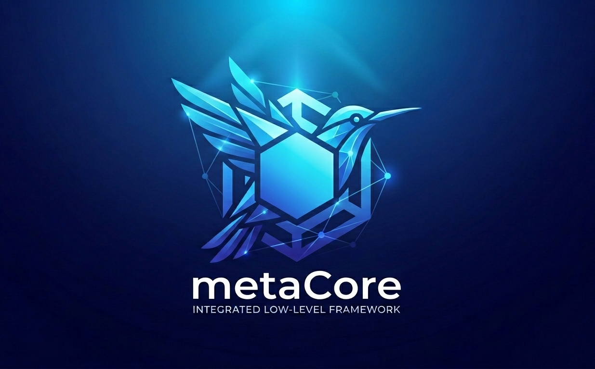

# metaCore 🚀

`metaCore` is a comprehensive, low-level ecosystem and framework written in **C / C++** and powered by automated tooling built with **PowerShell**.

It is designed to serve as a robust foundational infrastructure that provides developers with advanced helper tools to streamline development, testing, and error management with minimal external runtime dependencies.

---

## 🎯 Core Objectives

* **Streamline Software Engineering:** Provide a unified workspace for managing errors, warnings, and comprehensive unit testing.
* **Optimize Performance:** Offer accurate benchmarking suites and high-efficiency stream-like objects for fast data pipelines.
* **Smart Automation:** Integrate modern build utilities and codebase metrics powered by local AI for effortless documentation generation.
* **Future-Proof Vision:** While the framework currently focuses entirely on **C** and **C++**, the ultimate roadmap aims to expand coverage to **Zig** and **Go**.

---

## ✨ Key Features

### 1. System & Testing Utilities

* **Unit Testing Framework:** A flexible, embedded system to write and run automated unit tests, ensuring logic stability.
* **Error & Warning Handling:** An advanced mechanism to track, propagate, and handle errors/warnings gracefully at runtime.
* **Benchmarking Tools:** High-precision tools to measure execution time and resource consumption for critical optimization paths.

### 2. Low-Level I/O & Stream Processing

* **Stream-like Objects:** Specialized abstractions providing stream-based interfaces for seamless data reading and writing.
* **I/O Utilities:** Dedicated modules designed for high-performance file manipulation and data transfer.
* **Bitwise Handling System:** A comprehensive suite of advanced bitwise operation helpers written purely in **C** for direct, efficient memory/bit manipulation.

### 3. PowerShell Automation & AI Integration

* **Build & Analytics Scripts:** PowerShell automation tools designed for compiling, counting source lines of code (SLOC), and generating structural project metrics.
* **AI-Powered Smart Documentation:** Integrated modules that interface with local **Ollama** models to automatically document, explain, and update your codebase reference files.

---

## 🏗️ Architecture & Ecosystem

The framework relies on a centralized ecosystem structure:

* **The Ecosystem Object:** The codebase incorporates a primary central object that manages and ties together the core functionalities and subsystems.
* **Current Availability:** This main **Ecosystem** object is currently exclusive to **C++** to leverage object-oriented paradigms and advanced templates, while the underlying lower-level primitives remain accessible via **C**.

---

## 🗺️ Language Support Roadmap

| Language | Current Status | Available Features |
| :--- | :---: | :--- |
| **C** | 🔄 Partially Supported | Bitwise tools, core primitives, and underlying utilities |
| **C++** | ✅ Fully Supported | Complete framework suite, Ecosystem Object, Streams |
| **Zig** | ⏳ Planned | Comprehensive coverage for low-level system tooling |
| **Go** | ⏳ Planned | Concurrency-safe data primitives and systems tools |

---

## 🛠️ Requirements

To successfully run and compile the framework along with its automation suite, you will need:

* A modern compiler supporting up-to-date C/C++ standards.
* **PowerShell 7+** for executing build and analytics scripts.
* A local instance of **Ollama** to power the AI-driven documentation modules.

---

## 📜 License

This project is licensed under its respective terms - see the [LICENSE](LICENSE.md) file for details.
